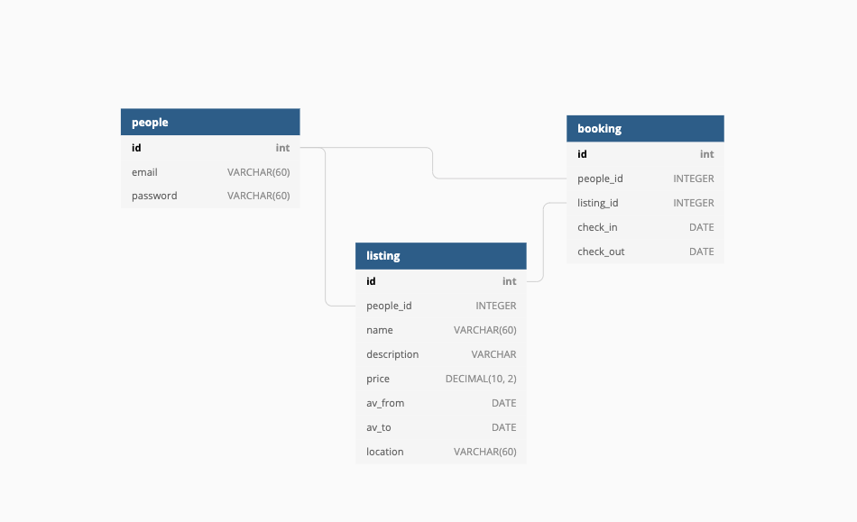

## Makers AirBnB clone challenge

Bootcamp group project to develop an AirBnB clone in 5 days. Developed using Test-Driven Development startegy.

## Stack

- `Ruby` language
- `RSpec` testing framework
- `html` and `css` for styling
- `postgres` for database

## Database Schema



## User Stories
```
As a new user
So that I can list my spaces
I'd like to be able to sign up
```

```
As an existing user
So that I can use the website features
I'd like to be able to sign in
```

```
As an existing user
So that I can end my session
I'd like to be able to sign out
```

```
As a MakersBnB system
So that I can follow regulations
I'd only like users that are over 18
```

```
As an existing user
So that I can see available spaces
I'd like to be able view all listings
```

```
As a existing user
So that I can receive bookings
I'd like to be able to add a new listing
```

## Try it!

Want to see & try our app? Here's how:
- Clone this repo using `git clone`
- `cd` into the project folder
- Open Terminal and run `rake setup`
- Run `rackup`
- Visit `localhost:9292`
